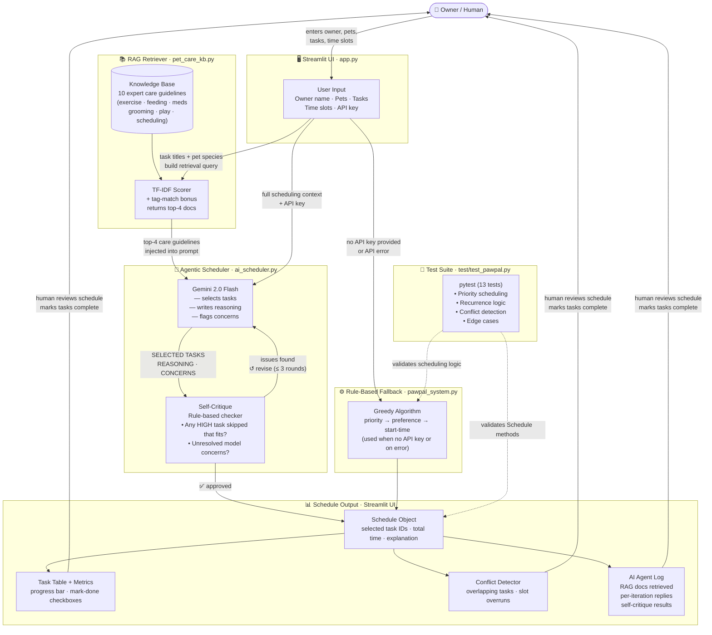

# PawPal+ System Architecture

## Component Overview

| Component | File | Role |
|---|---|---|
| **Streamlit UI** | `app.py` | Collects owner/pet/task input; renders output |
| **RAG Retriever** | `pet_care_kb.py` | Fetches relevant care guidelines before scheduling |
| **Agentic Scheduler** | `ai_scheduler.py` | Claude drafts, self-critiques, and refines the schedule |
| **Rule-Based Scheduler** | `pawpal_system.py` | Greedy fallback when no API key is provided |
| **Test Suite** | `test/test_pawpal.py` | 13 pytest tests validating core logic |

---

## System Diagram



---

## Data Flow  (step-by-step)

```
Input
  └─ Human fills in: owner info, pets, tasks (title/priority/duration/time), available slots

      │
      ▼
RAG Retrieval  (pet_care_kb.py)
  └─ Query = task titles + pet species
  └─ TF-IDF scores all 10 guidelines → returns top-4 most relevant

      │  top-4 care guideline strings
      ▼
Agentic Draft  (ai_scheduler.py  ·  Iteration 1)
  └─ Prompt = RAG context + scheduling context
  └─ Claude replies: SELECTED TASKS / REASONING / CONCERNS

      │
      ▼
Self-Critique  (rule-based)
  ├─ All HIGH-priority tasks included that could fit?
  └─ Any unresolved concerns flagged by the model?

      ├── ✅ "OK"  →  accepted, exit loop
      └── ⚠️  issues  →  feed critique back to Claude (up to 3 rounds)

      │
      ▼
Schedule Object built from Claude's final answer
  └─ Fuzzy title matching maps names → Task IDs → Schedule.selected_task_ids

      │
      ▼
Output (Streamlit UI)
  ├─ Task table with priority / duration / status / mark-done
  ├─ Conflict detection (overlaps + slot overruns)
  └─ AI Agent Log (expandable: RAG docs, each iteration, each critique)

      │
      ▼
Human reviews → marks tasks done → recurring tasks auto-enqueue next occurrence
```

---

## Where Human Oversight & Testing Occur

| Point | Type | What happens |
|---|---|---|
| Task creation | **Human input** | Owner decides task priorities and durations |
| Schedule review | **Human review** | Owner inspects the generated schedule before acting |
| Mark complete | **Human action** | Owner confirms each task was actually done |
| Self-Critique | **Automated check** | Rules verify HIGH-priority coverage after each Claude iteration |
| `pytest` suite | **Automated testing** | 13 tests verify scheduling correctness, conflict detection, and recurrence logic |
| AI Agent Log | **Human auditability** | Every RAG doc and Claude iteration is visible in the UI |
